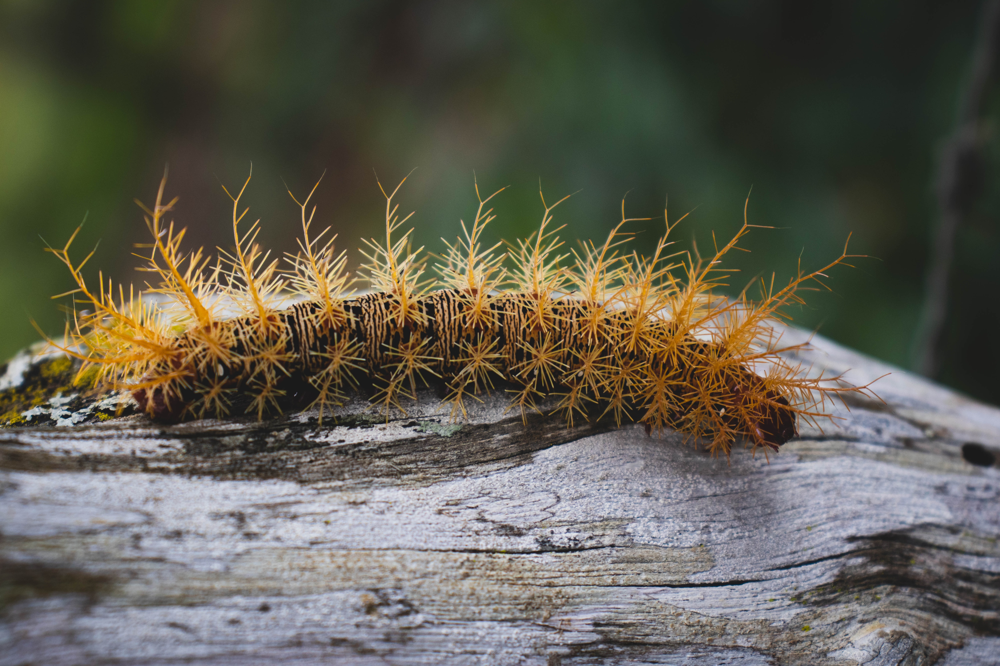

```{r setup, include=FALSE}
knitr::opts_chunk$set(echo = FALSE)

```

```{r, fig.align='center', out.width="70%"}

```

This website is intended for educators who teach or are interested in teaching Bayesian Statistics at the undergraduate level. You can find resources and join the [Undergraduate Bayesian Education Network](network.html). 


  